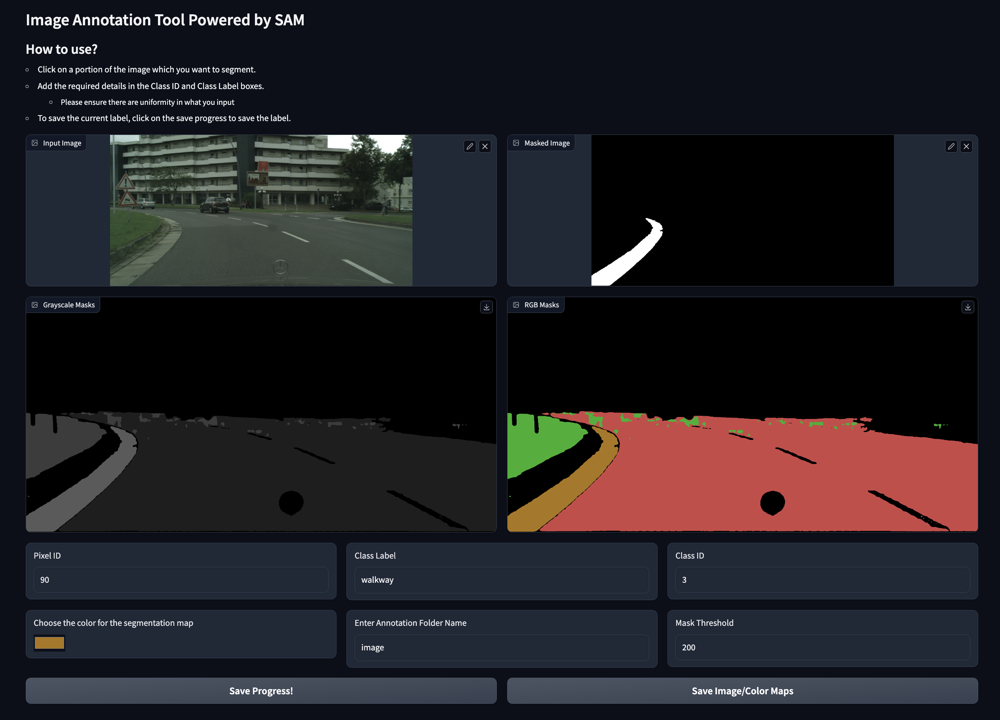

# Annotation-SAM
Yet another application of SAM, but this time to make image annotation efficient, cleaner, faster and with lesser key strokes.

## Installation
```
git clone https://github.com/aneesh-aparajit/annotation-SAM.git
cd annotation-SAM/
python -m venv venv
source venv/bin/activate
pip install -r requirements.txt
cd src/
python main.app
```

## Outputs


